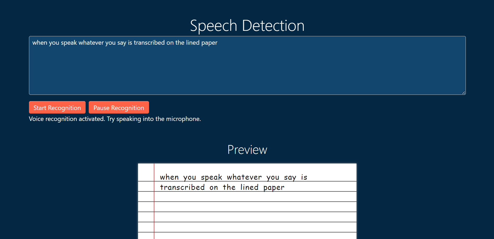

  <p align="center">
    A README template to jumpstart this project!
    <br />
    <a href="https://vaidehidangi23.github.io/SpeechDetectionTask/">View Demo</a>
     </p>
</div>


<!-- TABLE OF CONTENTS -->
<details>
  <summary>Table of Contents</summary>
  <ol>
    <li>
      <a href="#about-the-project">About The Project</a>
      <ul>
        <li><a href="#built-with">Built With</a></li>
      </ul>
    </li>
    <li>
      <a href="#getting-started">Prerequisites</a>
      </li>
    <li><a href="#usage">Usage</a></li>
    <li><a href="#roadmap">Roadmap</a></li>
    <li><a href="#contact">Contact</a></li>
    </ol>
</details>


<!-- ABOUT THE PROJECT -->
## About The Project

This is a tiny app that allows you to convert speech to text and gives it preview on a lined paper.

### Built With

* HTML
* CSS
* [Javascript](https://developer.mozilla.org/en-US/docs/Web/JavaScript)
* [Bootstrap](https://getbootstrap.com)
* [JQuery](https://jquery.com)


## Prerequisites

First, we check to see if the browser supports the Web Speech API by checking if the webkitSpeechRecognition object exists. If not, we suggest the user to use chrome or upgrade their browser.
* webkitSpeechRecognition
  ```sh
  if (!('webkitSpeechRecognition' in window)) {
    upgrade();
    }
  ```
Lastly, we create the webkitSpeechRecognition object which provides the speech interface, and set some of its attributes and event handlers.


<!-- USAGE EXAMPLES -->
## Usage

This app can be used for several purposes like to create notes.



_To use this app, please refer to the [SpeechDetection](https://github.io/vaidehidangi23/SpeechDetectionTask)_


<!-- ROADMAP -->
## Roadmap

- [x] Add textarea where speech is converted into text
- [ ] Create the webkitSpeechRecognition object and set some of its attributes and event handlers.
- [ ] Create buttons to start voice recognition and pause voice recognition
- [ ] Create a lined paper to show preview of the text

<!-- CONTACT -->
## Contact

Vaidehi Dangi - vaidehidangi23@gmail.com

Project Link: [https://github.io/vaidehidangi23/SpeechDetectionTask](https://github.io/vaidehidangi23/SpeechDetectionTask)


